# Projeto de Interface
 **01 Fluxo do Usuário**  
O diagrama apresentado na Figura 01 mostra o fluxo de interação do usuário pelas telas do sistema. Cada uma das telas deste fluxo é detalhada na seção de Wireframes que se segue.

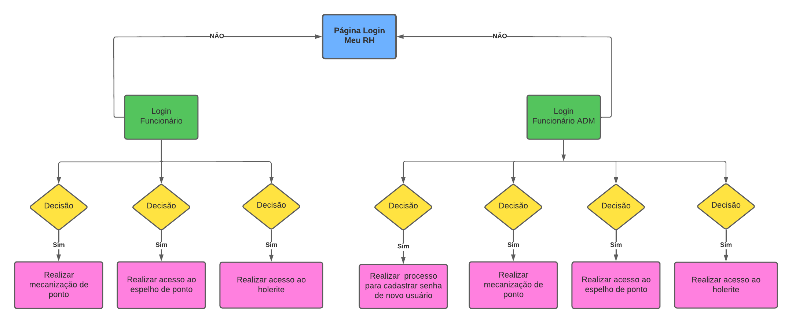

**02 Wireframes**  
As telas do projeto, se baseiam no fluxo do usuário detalhado no item anterior. Essas wireframes são similares entre si e estão compostas basicamente de quatro blocos, a saber, o cabeçalho, conteúdo e o rodapé. Abaixo estão listados os significados de cada um dos blocos.

    • Cabeçalho - região onde se localizam os elementos fixos de identidade (logo)  e a barra de navegação principal do site (menu da aplicação);
    • Conteúdo - apresenta o conteúdo da tela do site com informações, cadastros e consultas;
    • Rodapé - região que apresenta informações sobre os criadores do site.
 

**1.1 Tela de login**  

Essa tela permite ao usuário adentrar no site por meio de um cadastro previamente realizado. As informações que explicam a função da página estão dispostas num painel simples, com os dizeres “Faça seu login”, permitindo uma compreensão rápida, para o usuário, da função da página.
O painel possui três campos de preenchimento para o usuário, sendo que ambos contém dizeres que explicam a função daquele campo. No caso, o campo de inserira seu CPG previamente cadastrado, e, logo abaixo, o campo para a senha cadastrada e a opção de seleção funcionário sou gestão de RH.
	Além disso, também contém uma caixa assinalável ─ “lembrar-me” ─ cuja função é manter o preenchimento automático dos dois campos de preenchimento, tornando mais ágil o processo de login nas próximas vezes.

Figura 2 - Login versão desktop

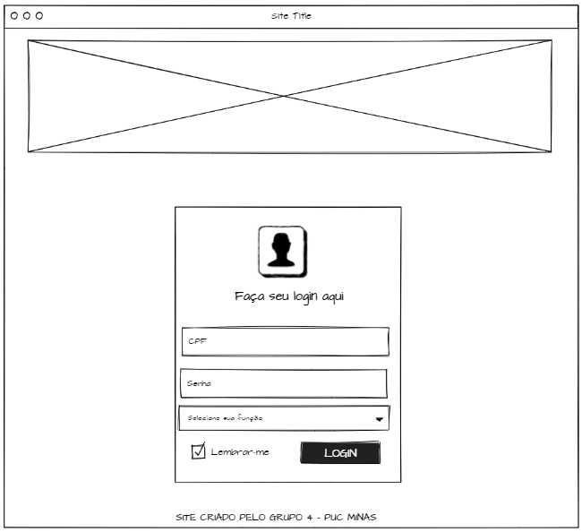

Figura 3 - Login versão mobile

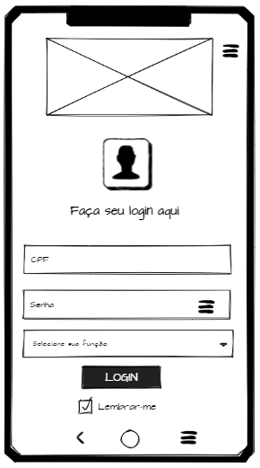

**1.2 Tela bem vindo**
 
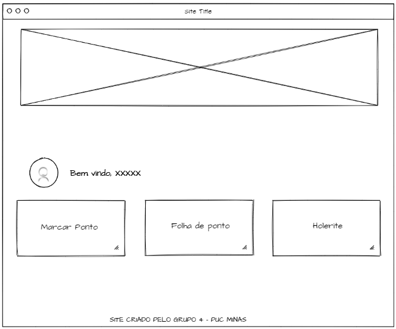

Figura 5 – Bem vindo (funcionário) versão mobile

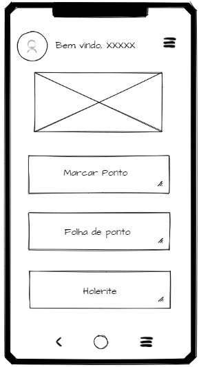

Figura 6 – Bem vindo (gestão/RH(ADM)) versão desktop

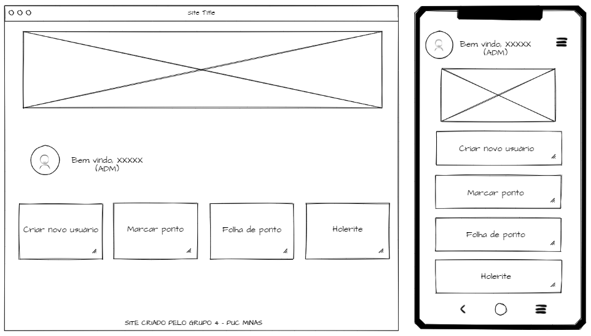

Figura 7 – Bem vindo (gestão/RH(ADM)) versão mobile

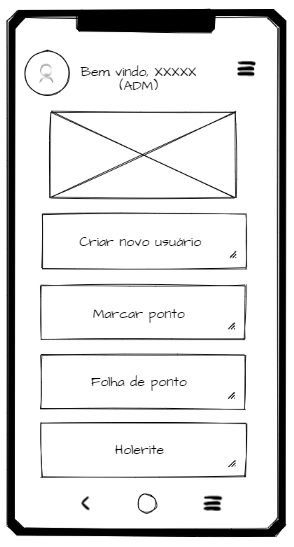

**1.3Marcar ponto**  

Tela utilizada para funcionários registrarem o ponto no home office, disponível também na tela de gestor/RH(ADM)  

Figura 8 – Marcar ponto versão desktop

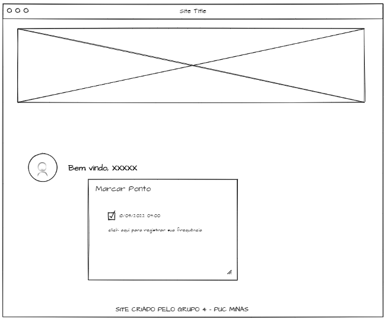

Figura 9 – Marcar ponto versão mobile

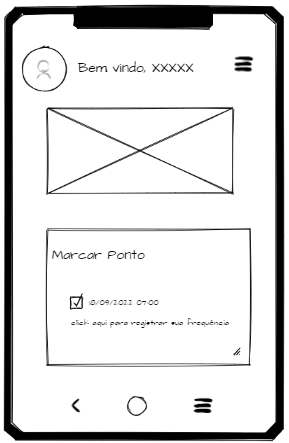

**1.4 Consulta de cartão de ponto**  
Consulta cartão de ponto versão desktop  
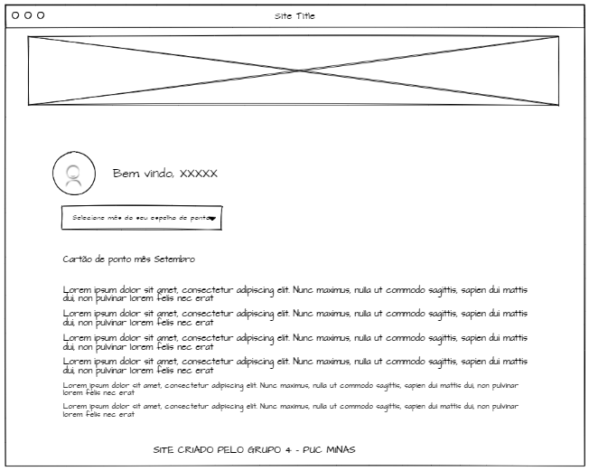

 Consulta cartão de ponto versão mobile
 
 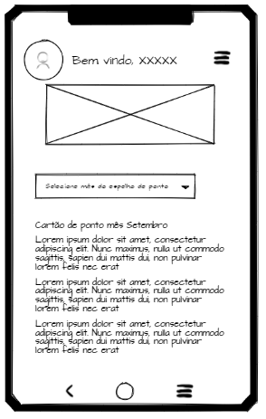

**1.5Tela de Contatos – Fale conosco**  
Consulta holerite versão desktop

 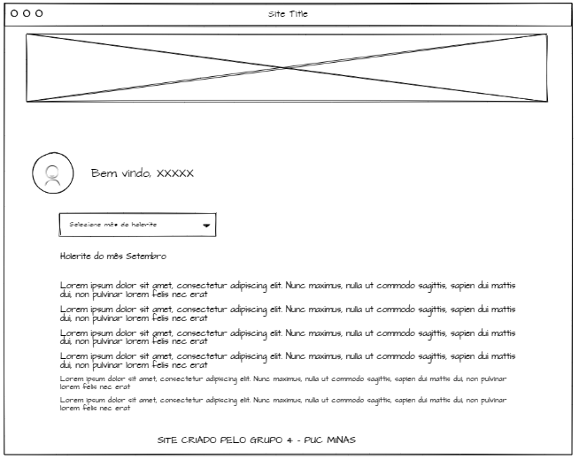
 
 Consulta holerite versão mobile
 
  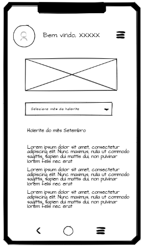
  
  **1.6 Tela de cadastro de novo usuário**  
  
  Usada para cadastrar novos usuários dos funcionários.  
  
  Cadastro de novo usuário versão desktop
  
   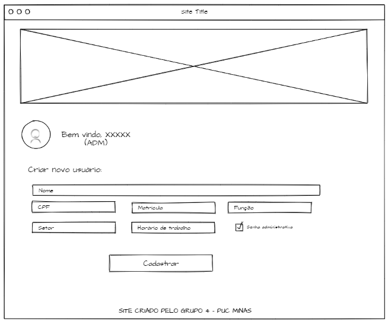
   
   Cadastro de novo usuário versão mobile
   
   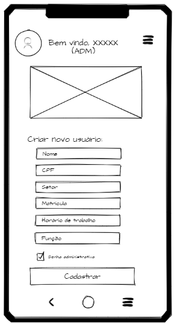
  

  

