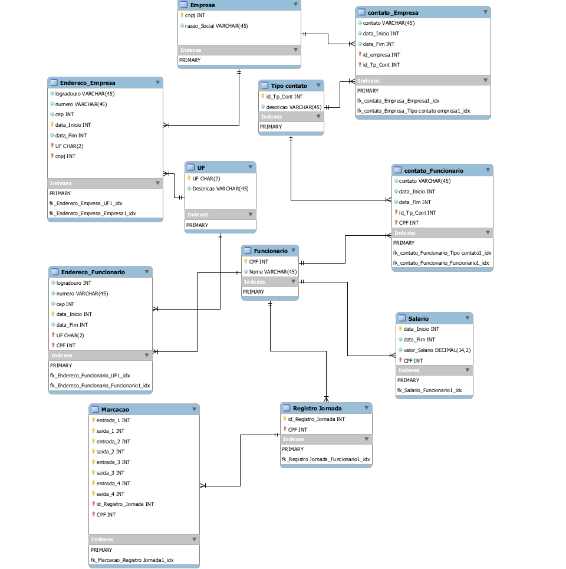

# Arquitetura da Solução

## Diagrama de Classes

## Projeto  

A solução implementada conta com os seguintes módulos:  
Navegador - Interface básica do sistema   
Páginas Web - Conjunto de arquivos HTML, CSS, JavaScript e imagens que implementam as funcionalidades do sistema.  
Local Storage - armazenamento mantido no Navegador, onde são implementados bancos de dados.
## Tecnologias Utilizadas**  

*HTML
*CSS
*JAVASCRIPT
*NODEJS
*SQL

## Hospedagem

Github  
Local Storage 
