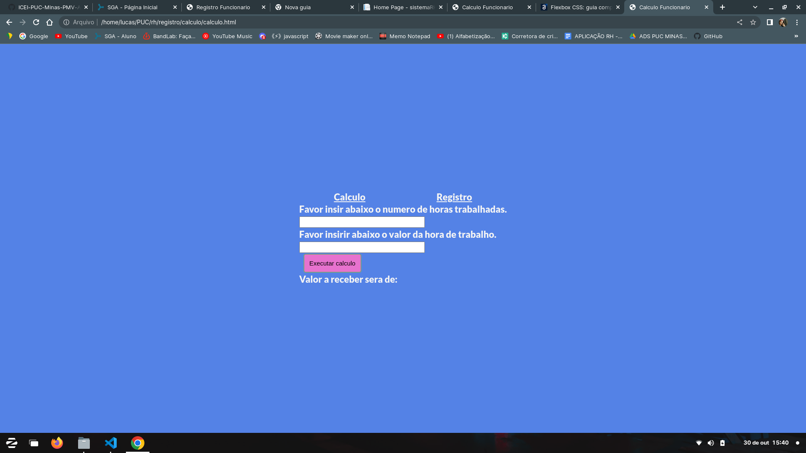
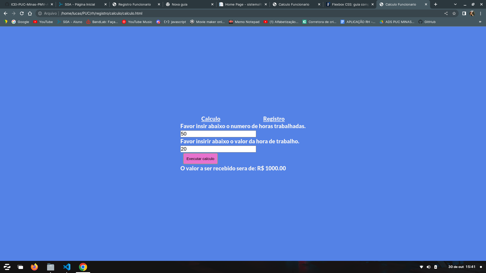
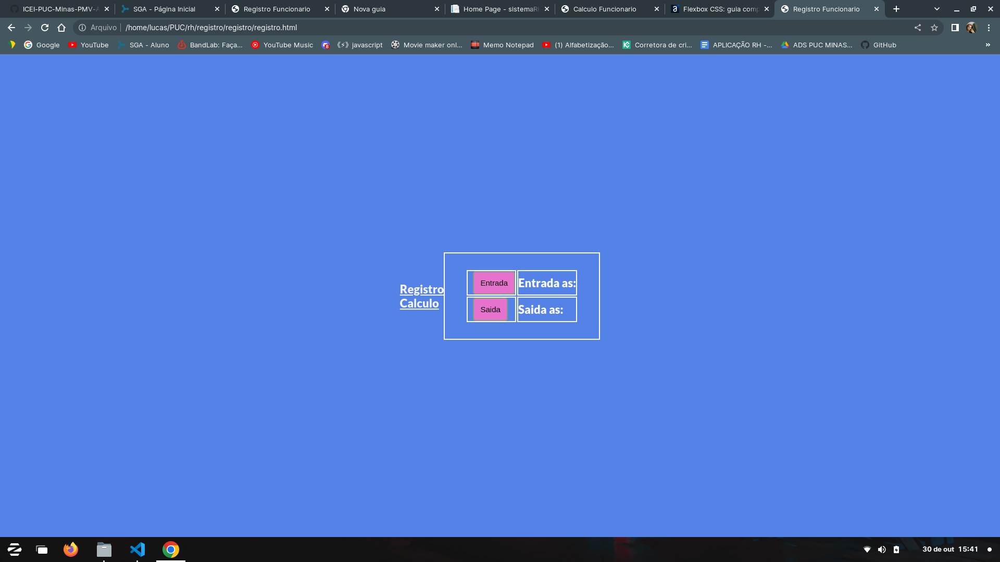
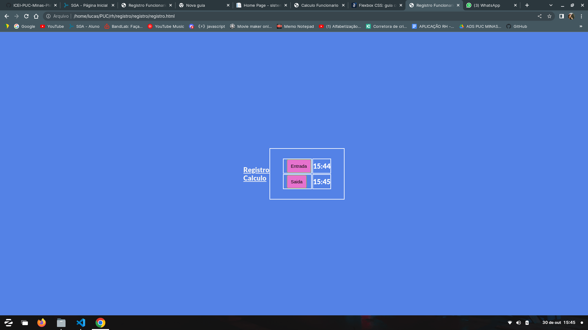

# Registro de Testes de Usabilidade

**Pagina de calculo**  
Figura 01 mostra o a pagina de calculo antes de executar a função.  

Figura 02 mostra o a pagina de calculo antes de executar a função.  

**Pagina de Registro**  
Figura 03 mostra o a pagina de registro antes de executar o registro  

Figura 04 mostra o a pagina de registro depois de executar o registro  

As referências abaixo irão auxiliá-lo na geração do artefato “Registro de Testes de Usabilidade”.

> **Links Úteis**:
> - [Ferramentas de Testes de Usabilidade](https://www.usability.gov/how-to-and-tools/resources/templates.html)
